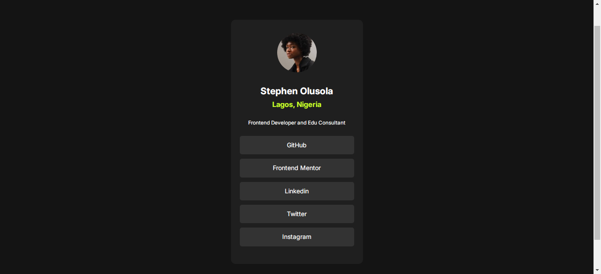
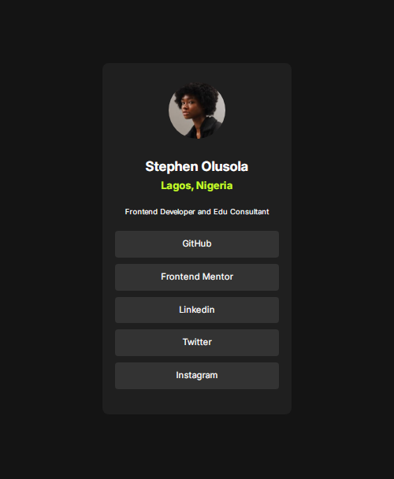
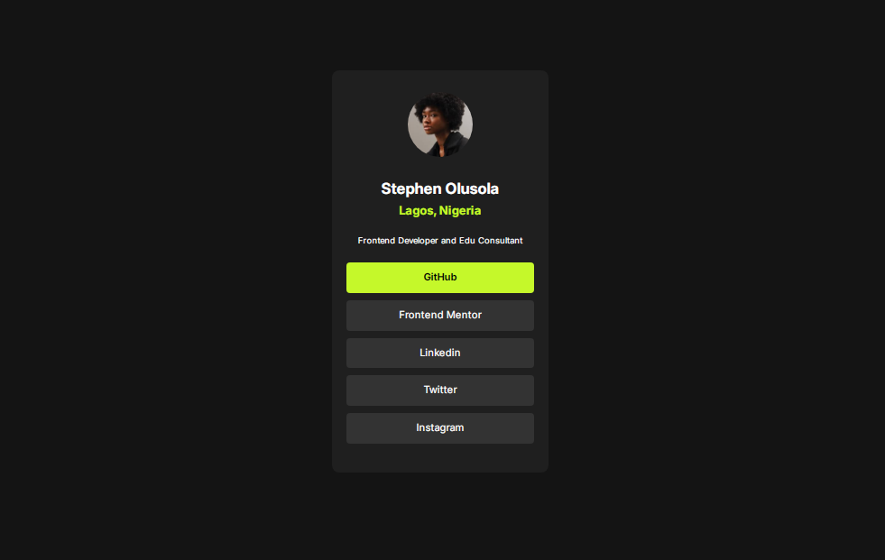

# Frontend Mentor - Social links profile solution

This is a solution to the [Social links profile challenge on Frontend Mentor](https://www.frontendmentor.io/challenges/social-links-profile-UG32l9m6dQ).

## Table of contents

- [Overview](#overview)
  - [The challenge](#the-challenge)
  - [Screenshot](#screenshot)
  - [Links](#links)
- [My process](#my-process)
  - [Built with](#built-with)
  - [What I learned](#what-i-learned)
  - [Continued development](#continued-development)
- [Author](#author)

## Overview

### The challenge

Users should be able to:

- See hover and focus states for all interactive elements on the page

### Screenshot





### Links

- Solution URL: (https://www.frontendmentor.io/solutions/responsive-landing-page-using-css-flex-ikoASvhVHG)
- Live Site URL: (https://desthubtech.github.io/social-link-project/)

## My process

nill

### Built with

- HTML
- CSS
- Flexbox

### What I learned

```css
.box {
  display: flex;
  align-items: center;
  justify-content: center;
}
a:hover {
  background-color: hsl(75, 94%, 57%);
  color: #000;
  font-weight: bold;
}
```

### Continued development

I would like to learn more about Sass conplier and bootstrap

## Author

- Website - [Stephen Olusola](https://www.desthub.com.ng)
- Frontend Mentor - [@Desthubtech](https://www.frontendmentor.io/profile/Desthubtech)
- GitHub - [@Desthubtech](https://github.com/Desthubtech)
